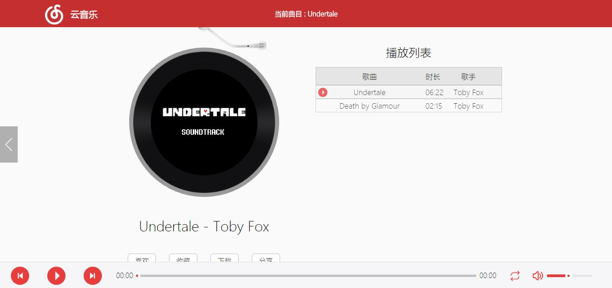

# 仿写 网易云音乐

使用原生 JS 实现简单网易云音乐仿写

访问地址：[netease-music](https://heal6.github.io/netease-music/) 

## 效果演示

 

## 简介

1. 第 1 页为云音乐曲库

   点击专辑封面可将音乐添加到播放列表
     _第一页 云音乐曲库_ 

2. 第 2 页为网易云音乐播放界面
     _第二页 播放页面_ 

## 已实现的功能

1. 播放 暂停 切歌
2. 顺序播放 列表循环
3. 拖动进度条调节进度
4. 调节音量
5. 网易云音乐播放界面唱片机转动效果
